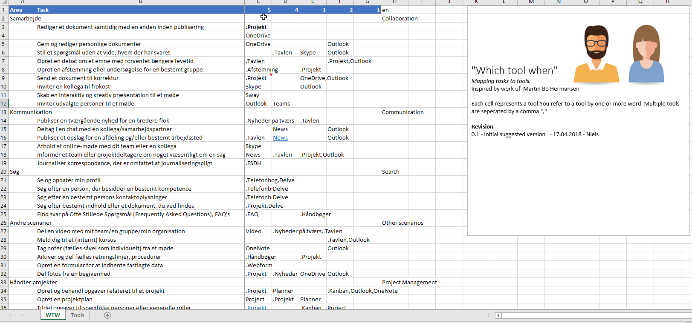
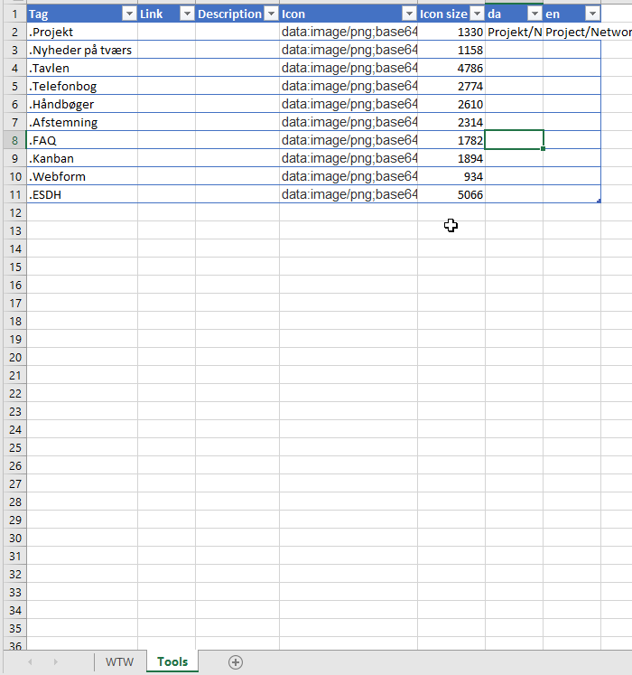
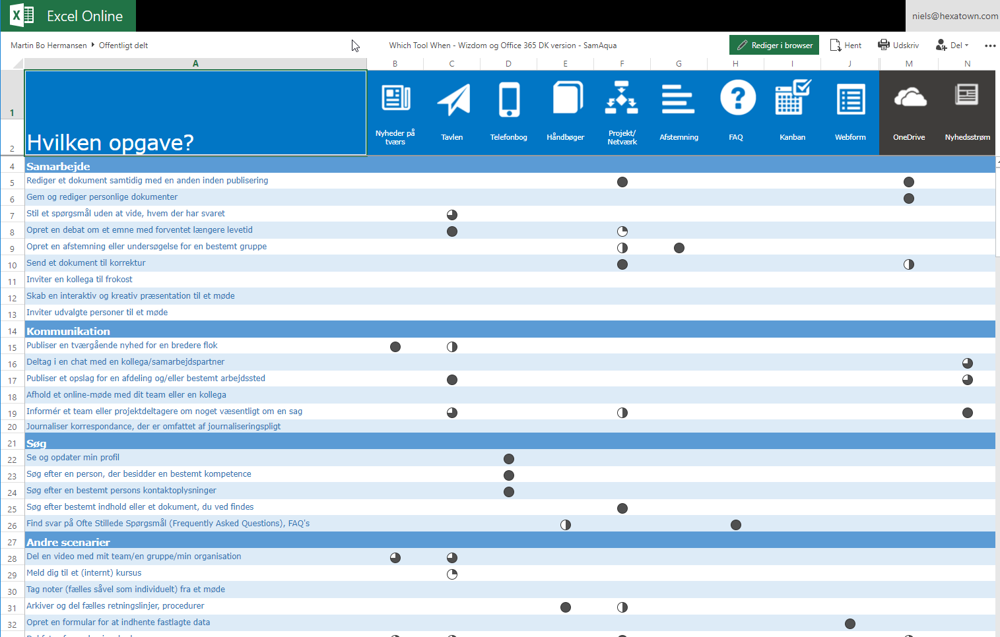

The "which tool when" module is inspired by original work of [Martin Bo Hermansen](https://www.linkedin.com/in/martinbh/) from [Samaqua](https://www.samaqua.dk/) who developeed an Excel format at illustrated in the figure "Hvilken opgave?" - danish for "Which task" or "Which to when".

If you have to do with user interface where the is an unbalance between what you see and what is important, the user will not discover everything. So based on Marin's work, we have tried to transform that into a format which makes is possible to keep everything on the same page. Instead of listing tasks and tools and having the intersection indicate the relevance and fit, we go for a list of task, then a column indicating relevance, where the intersection compromosis the tools which fits.
___

# Get started 
By organizing your tasks in areas, and ranking the tool 5 to 1 you can easily get started in Excel [Download template](#/action/wtw-template)

You can author the content in Excel, 2 tabs is required to be present

- WTW 
- Tools

Both are described here

## WTW tab 

| Area | Task | 5 (best) | 4 | 3 | 2 | 1 (worst) | da | ja |
| --- | --- | --- | --- | --- | --- | --- | --- | --- |
|Document authoring|
| | Write a letter | Word |  |  | | Notepad  | Skriv et brev | 手紙を書く  | |
| | | Word Online |  |  | | | | | |

### Columns explanied

| Column | Definition | Example |
| --- | --- | --- |
| Area | Area of task |  Document authoring |
| Task | Topic of task | Write a document
| 5 | Tag of Best tool for the job| Word |
| 4 | | Tag |
| 3 | | Tag |
| 2 | | Tag | 
| 1 | Tag of worst tool | Notepad |
| (xx) | Translation, use an [ISO 639-1 Code](https://en.wikipedia.org/wiki/List_of_ISO_639-1_codes) | ja for Japanese|

## Tools tab
| Tag | Link | Description | Icon |  da | en |
| --- | --- | --- | --- | --- | --- | --- | --- | --- |
| Outlook | #/services/outlook | . | data:image/png;base64,iVBORw0KGgoAAAANSUhEUgAA.... | Outlook | Outlook |
| Megawriter | https://megawriter |. |data:image/png;base64,iVBORw0KGgoAAAANSUhEUgAA.... | 

### Columns explanied

| Column | Definition | Example |
| --- | --- | --- |
| Tag | Tag of the tool, 2 types support - short and long |  Word  or Microsoft.Word if Word is having another use in your domain |
| Link | Link to the tool | http://xxx or #/service/word or https://office.live.com/start/Word.aspx 
| Description | 
| Icon | | . |
| (xx) | Translation, use an [ISO 639-1 Code](https://en.wikipedia.org/wiki/List_of_ISO_639-1_codes) | ja for Japanese|

### Sample screenshots

